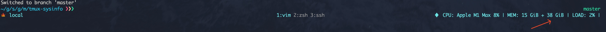

## Tmux SysInfo

> 这是一个用于获取系统 CPU、内存以及负载信息的 Tmux 插件.

### 一、如何安装

推荐使用 tpm 工具来管理 tmux 插件, 对于 tpm 用户您需要添加以下配置到 `~/.tmux.conf` 中:

```sh
set -g @plugin 'mritd/tmux-sysinfo'
```

然后使用快捷键 `Prefix + I` 执行安装即可.

如果您未使用 tpm 也不必担心, tmux-sysinfo 采用 Go 语言编写, 且仅有一个二进制文件; 您可以直接在 [Release](https://github.com/mritd/tmux-sysinfo/releases) 页面下载最新的版本, 并放置在任何位置.

```sh
# 以 macOS M1 芯片组为例
curl -sSL https://github.com/mritd/tmux-sysinfo/releases/download/v0.0.2/tmux-sysinfo-darwin-arm64 > /usr/local/bin/tmux-sysinfo
chmod +x /usr/local/bin/tmux-sysinfo
```

### 二、如何使用

您尽需要在 `~/.tmux.conf` 中添加以下配置即可激活 tmux-sysinfo:

```sh
# 注意, 如果手动安装的请将文件路径替换为 /usr/local/bin/tmux-sysinfo
set -g status-right '#[fg=brightcyan]♦  #($TMUX_PLUGIN_MANAGER_PATH/tmux-sysinfo/tmux-sysinfo) | [%H:%M]'
```

### 三、自定义样式

tmux-sysinfo 当前包含三部分输出内容: CPU、内存、系统负载; 默认情况下 tmux-sysinfo 输出样式如下:


您可以使用 `--mini` 选项来显示最小化的样例:

```sh
set -g status-right '#[fg=brightcyan]♦  #($TMUX_PLUGIN_MANAGER_PATH/tmux-sysinfo/tmux-sysinfo --mini) | [%H:%M]'
```


除了内置的两种样式以外, tmux-sysinfo 允许使用 Go 模版完全自定义输出样式(您需要自行学习 Go 模版引擎语法), 您在模版引擎中可以读取的结构体如下所示(更深层次的属性请查看源码):

```go
// 最顶级的结构体(.)
type Info struct {
	CPU  *CPUInfo
	Mem  *MemoryInfo
	Load *LoadInfo
}

// CPU 信息(.CPU)
type CPUInfo struct {
	Percent   []float64
	InfoStats []cpu.InfoStat
}

// 内存信息(.Mem)
type MemoryInfo struct {
	Stat *mem.VirtualMemoryStat
	Swap *mem.SwapMemoryStat
}

// 系统负载信息(.Load)
type LoadInfo struct {
	Stat *load.AvgStat
	Misc *load.MiscStat
}
```

tmux-sysinfo 提供了三个选项来定义每一部分的输出模版:

```sh
--cpu-tpl string     CPU information rendering template (default "CPU: {{(index .CPU.InfoStats 0).ModelName}} {{index .CPU.Percent 0 | percentage}}")
--mem-tpl string     Memory information rendering template (default "MEM: {{.Mem.Stat.Used | humanizeIBytes}}")
--load-tpl string    Load information rendering template (default "LOAD: {{.Load.Stat.Load1 | percentage}}")
```

您可以根据需要来自行调整输出模版, 例如您想要显示内存剩余空间, 你可以这样更改模版:

```sh
set -g status-right '#[fg=brightcyan]♦  #($TMUX_PLUGIN_MANAGER_PATH/tmux-sysinfo/tmux-sysinfo --mem-tpl="MEM: {{.Mem.Stat.Used | humanizeIBytes}} + {{.Mem.Stat.Free | humanizeIBytes}}") | [%H:%M]'
```



为了美化输出结果, tmux-sysinfo 内置了以下模版引擎函数用于格式化输出:

- `humanizeBytes`: 将 uint64 类型的纯数值转换为人类可读的格式, 例如 `82854982 -> 83 MB`
- `humanizeIBytes`: 类似 `humanizeBytes` 不同之处是它以 `1024` 为单位计算, 例如 `82854982 -> 79 MiB`
- `percentage`: 将 float64 类型的纯数值格式化成百分比字符串, 例如 `22.34123545 -> 22%`

### 四、其他说明

有些情况下由于 tmux-sysinfo 过长的输出可能导致截断, 你可以调整以下两个参数来解决这种问题:

```sh
# 状态栏左侧最大长度
set -g status-left-length 20

# 状态栏右侧最大长度
set -g status-right-length 60
```

或许调整之后您会发现状态栏中间的窗口列表发生了左右偏移, 你可以通过以下选项强制窗口列表居中:

```sh
set -g status-justify absolute-centre
```

