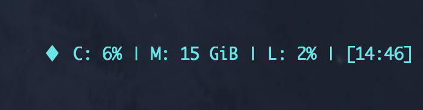

EN | [ZH](./README_zh.md)

## Tmux SysInfo


> This is a Tmux plugin for obtaining system CPU, memory, and load information.

### How to install

It is recommended to use the [tpm](https://github.com/tmux-plugins/tpm) tool to manage Tmux plugins. For tpm users, you need to add the following configuration to your `~/.tmux.conf` file:

```sh
set -g @plugin 'mritd/tmux-sysinfo'
```

Then, use the shortcut `Prefix + I` to install it.

If you are not using tpm, don't worry. Tmux SysInfo is written in Go and consists of a single binary file. You can directly download the latest version from the [Release page](https://github.com/mritd/tmux-sysinfo/releases) and place it anywhere you like.

```sh
# As an example for the macOS M1 chip
curl -sSL https://github.com/mritd/tmux-sysinfo/releases/download/v0.0.2/tmux-sysinfo-darwin-arm64 > /usr/local/bin/tmux-sysinfo
chmod +x /usr/local/bin/tmux-sysinfo
```

### How to use

To activate tmux-sysinfo, you need to add the following configuration to your `~/.tmux.conf` file:

```sh
# Note: If you have manually installed tmux-sysinfo, you need to replace the file path with /usr/local/bin/tmux-sysinfo.
set -g status-right '#[fg=brightcyan]♦  #($TMUX_PLUGIN_MANAGER_PATH/tmux-sysinfo/tmux-sysinfo) | [%H:%M]'
```

### Custom style

The current version of tmux-sysinfo includes three sections of output: CPU, memory, and system load. By default, tmux-sysinfo has the following output style:


Sure! Here's the minimized example of the tmux-sysinfo output using the `--mini` option:

```sh
set -g status-right '#[fg=brightcyan]♦  #($TMUX_PLUGIN_MANAGER_PATH/tmux-sysinfo/tmux-sysinfo --mini) | [%H:%M]'
```



In addition to the two built-in styles, tmux-sysinfo allows for fully customized output styles using Go templates(you will need to learn Go template engine syntax on your own). The structs that can be accessed within the template engine are shown below (for more detailed properties, please refer to the source code):

```go
// The top-level struct (.)
type Info struct {
	CPU  *CPUInfo
	Mem  *MemoryInfo
	Load *LoadInfo
}

// CPU info(.CPU)
type CPUInfo struct {
	Percent   []float64
	InfoStats []cpu.InfoStat
}

// Memory info(.Mem)
type MemoryInfo struct {
	Stat *mem.VirtualMemoryStat
	Swap *mem.SwapMemoryStat
}

// System load info(.Load)
type LoadInfo struct {
	Stat *load.AvgStat
	Misc *load.MiscStat
}
```

tmux-sysinfo provides three options to define the output template for each section:

```sh
--cpu-tpl string     CPU information rendering template (default "CPU: {{(index .CPU.InfoStats 0).ModelName}} {{index .CPU.Percent 0 | percentage}}")
--mem-tpl string     Memory information rendering template (default "MEM: {{.Mem.Stat.Used | humanizeIBytes}}")
--load-tpl string    Load information rendering template (default "LOAD: {{.Load.Stat.Load1 | percentage}}")
```

You can adjust the output template according to your needs. For example, if you want to display the remaining memory space, you can make the following changes to the template:

```sh
set -g status-right '#[fg=brightcyan]♦  #($TMUX_PLUGIN_MANAGER_PATH/tmux-sysinfo/tmux-sysinfo --mem-tpl="MEM: {{.Mem.Stat.Used | humanizeIBytes}} + {{.Mem.Stat.Free | humanizeIBytes}}") | [%H:%M]'
```


To beautify the output results, tmux-sysinfo provides the following built-in template engine functions for formatting the output:

- `humanizeBytes`: Converts a pure numerical value of type uint64 into a human-readable format, for example `82854982 -> 83 MB`
- `humanizeIBytes`: Similar to `humanizeBytes`, the difference is that it calculates based on the unit of 1024, for example `82854982 -> 79 MiB`
- `percentage`: Formats a pure numerical value of type float64 into a percentage string, for example `22.34123545 -> 22%`

### Other tips

In some cases, the long output of tmux-sysinfo may be truncated. You can adjust the following two parameters to fix this issue:

```sh
# Maximum length of the left side of the status bar.
set -g status-left-length 20

# Maximum length of the right side of the status bar.
set -g status-right-length 60
```

After making adjustments, you may notice that the window list in the middle of the status bar is shifted to the left or right. You can force the window list to be centered using the following option:

```sh
set -g status-justify absolute-centre
```

**In extremely rare cases, you may want to display only CPU and memory information. You can adjust this using the `--enabled` option:**

```sh
set -g status-right '#[fg=brightcyan]♦  #($TMUX_PLUGIN_MANAGER_PATH/tmux-sysinfo/tmux-sysinfo --enabled=cpu,mem) | [%H:%M]'
```

Similarly, if you are not satisfied with the current display order, you can make adjustments as follows:

```sh
set -g status-right '#[fg=brightcyan]♦  #($TMUX_PLUGIN_MANAGER_PATH/tmux-sysinfo/tmux-sysinfo --enabled=mem,cpu,load) | [%H:%M]'
```

**In any case, you can always refer to the latest documentation by using the `--help` command or directly execute the `tmux-sysinfo` command to view the styles.**

```sh
~ ❯❯❯ tmux-sysinfo
CPU: Apple M1 Max 8% | MEM: 16 GiB | LOAD: 5%
~ ❯❯❯ tmux-sysinfo -h
Tmux system info plugin

Usage:
  tmux-sysinfo [flags]

Flags:
      --enabled string     Which information output is enabled (default "all")
      --mini               Use default mini template
      --cpu-tpl string     CPU information rendering template (default "CPU: {{(index .CPU.InfoStats 0).ModelName}} {{index .CPU.Percent 0 | percentage}}")
      --mem-tpl string     Memory information rendering template (default "MEM: {{.Mem.Stat.Used | humanizeIBytes}}")
      --load-tpl string    Load information rendering template (default "LOAD: {{.Load.Stat.Load1 | percentage}}")
      --delimiter string   Delimiter between information areas (default "|")
      --per-cpu            Get the usage percentage of each CPU
  -h, --help               help for tmux-sysinfo
  -v, --version            version for tmux-sysinfo
```

